# 🩺 Medistats App

A modern Flutter application designed to simplify the management of Internal Medicine clinics by providing an intuitive and efficient way to organize patients and their medical sessions.

Built with **Flutter** following the **MVVM (Model-View-ViewModel)** architecture and powered by **Cubit (flutter_bloc)** for scalable and maintainable state management.

---

# ✨ Overview

Managing patients and their medical history manually can be time-consuming and error-prone.

**Medistats** helps doctors organize patient records, track medical sessions, document diagnoses, prescriptions, and clinical notes through a clean, modern, and user-friendly interface.

---

# 🚀 Features

## 👨‍⚕️ Patient Management

* Add new patients
* Edit patient information
* Delete patients with confirmation
* Search patients by name
* Display all patients using modern cards
* Store basic patient information:

  * Full Name
  * Age
  * Phone Number
  * Chronic Diseases (Diabetes / Hypertension)

---

## 📋 Session Management

Each patient has their own medical sessions.

Each session includes:

* Diagnosis
* Medications
* Doctor Notes
* Session Date

Available operations:

* Add Session
* Update Session
* Delete Session
* View Complete Session History

---

## 🎨 User Experience

* Native Splash Screen
* Flutter Splash Screen
* Beautiful Empty States
* Smooth Bottom Sheets
* Modern Popup Menus
* Delete Confirmation Bottom Sheets
* Responsive UI
* Clean Material Design
* Fast & Lightweight Performance

---

# 🏛️ Architecture

The project follows the **MVVM (Model-View-ViewModel)** architecture for better scalability and maintainability.

```
lib
│
├── core
│
├── features
│   ├── patients
│   │   ├── data
│   │   └── presentation
│   │
│   └── sessions
│       ├── data
│       └── presentation
│
└── main.dart
```

### State Management

* Cubit (flutter_bloc)

The application uses Cubit to separate business logic from UI while keeping the codebase clean and easy to extend.

---

# 📱 Screenshots

## 1. Native Splash Screen

<p align="center">
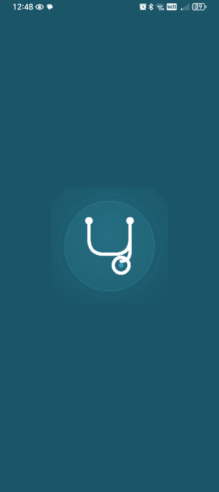
</p>

---

## 2. Flutter Splash Screen

<p align="center">
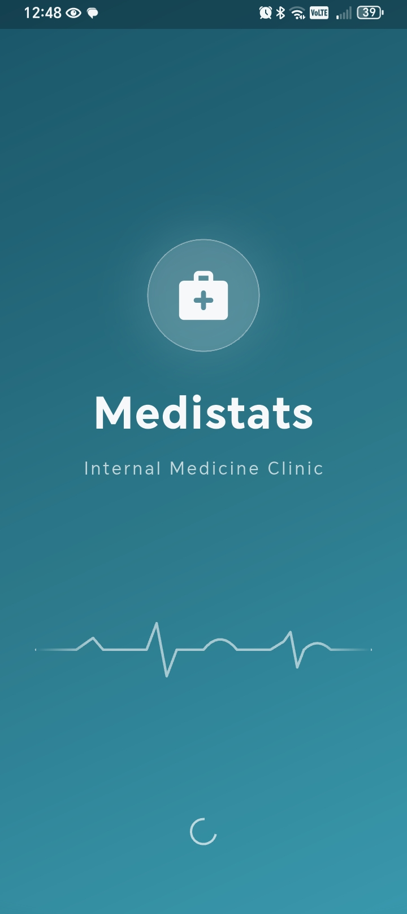
</p>

---

## 3. Empty Patients Screen

<p align="center">
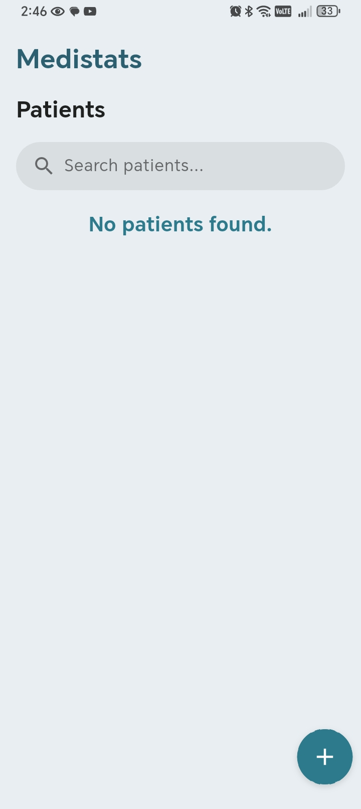
</p>

---

## 4. Patients Screen

<p align="center">
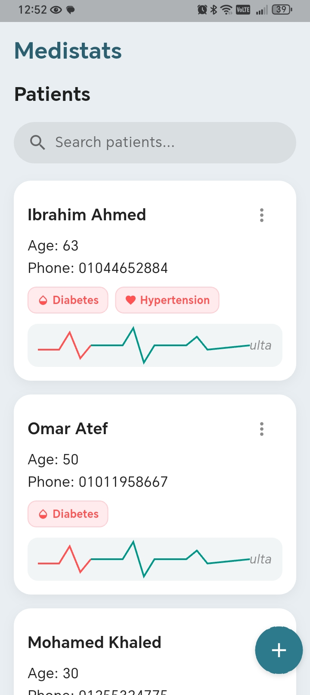
</p>

---

## 5. Add Patient Bottom Sheet

<p align="center">
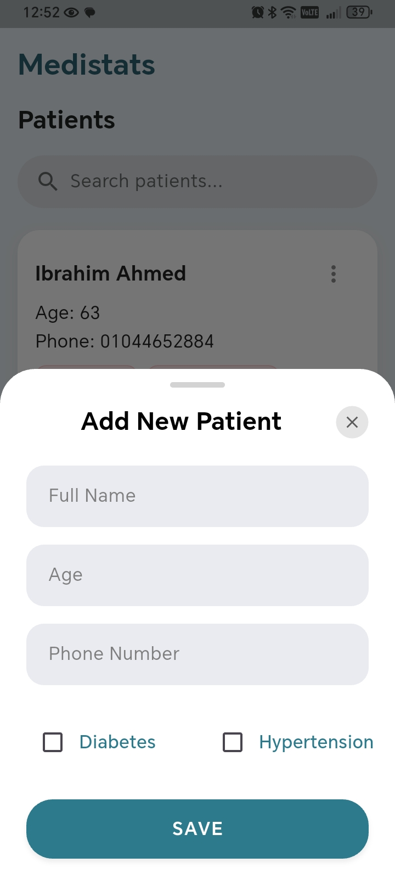
</p>

---

## 6. Patient Actions Menu

<p align="center">
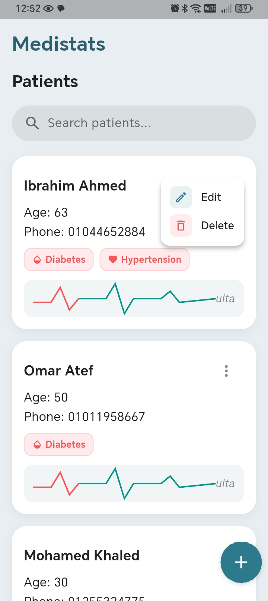
</p>

---

## 7. Edit Patient Bottom Sheet

<p align="center">
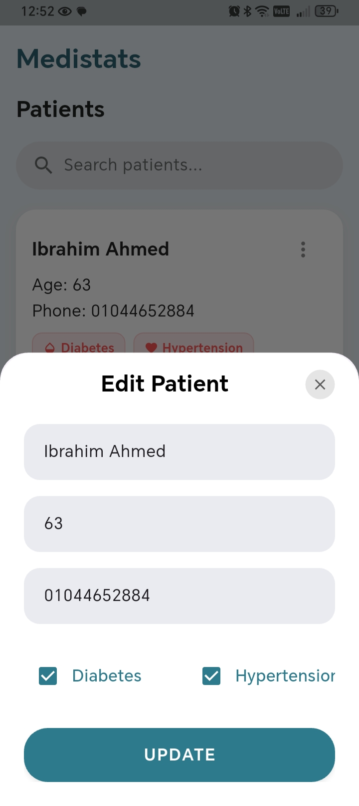
</p>

---

## 8. Delete Patient Confirmation

<p align="center">
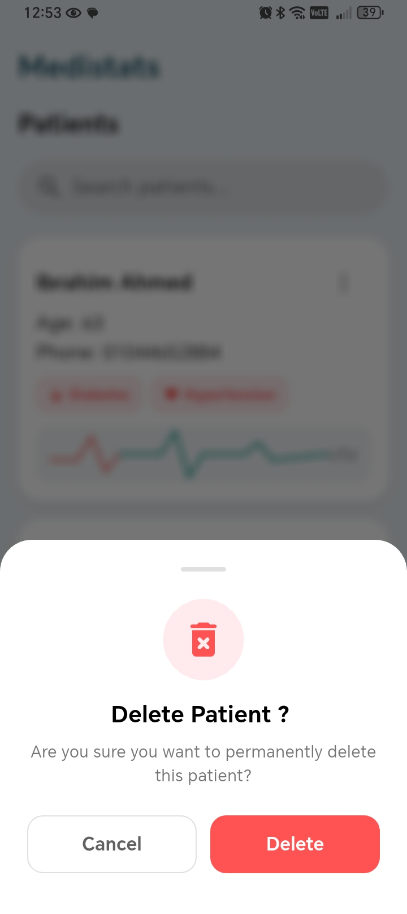
</p>

---

## 9. Empty Sessions Screen

<p align="center">
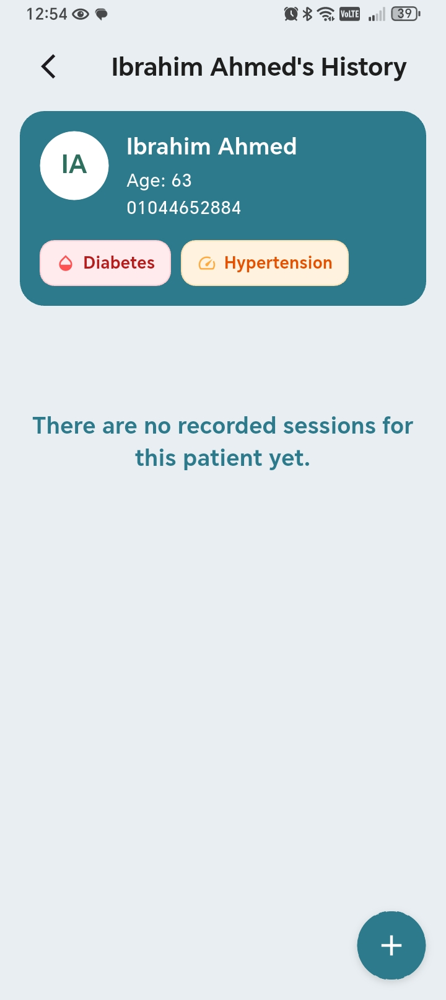
</p>

---

## 10. Add Session Bottom Sheet

<p align="center">
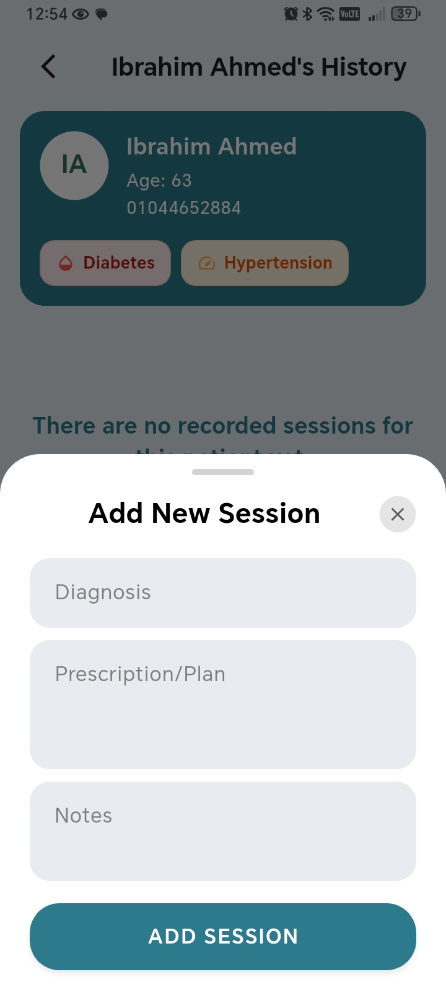
</p>

---

## 11. Session Actions Menu

<p align="center">
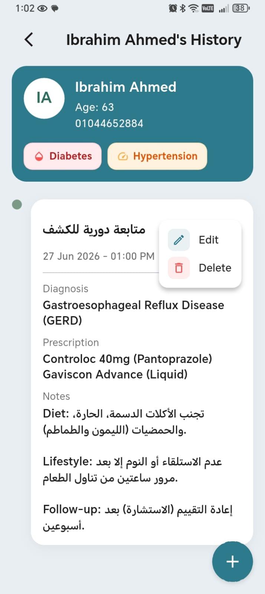
</p>

---

## 12. Update Session Bottom Sheet

<p align="center">
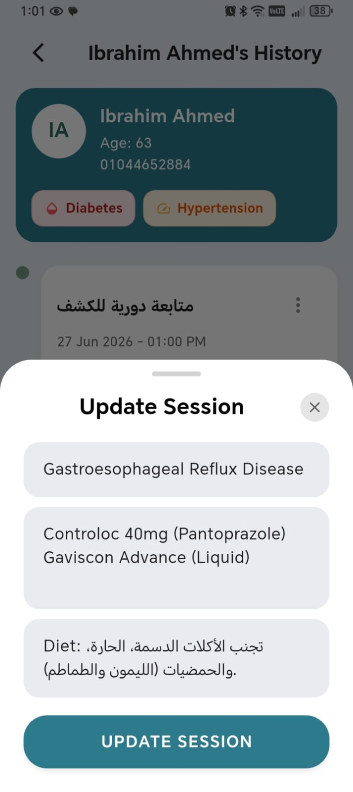
</p>

---

## 13. Delete Session Confirmation

<p align="center">
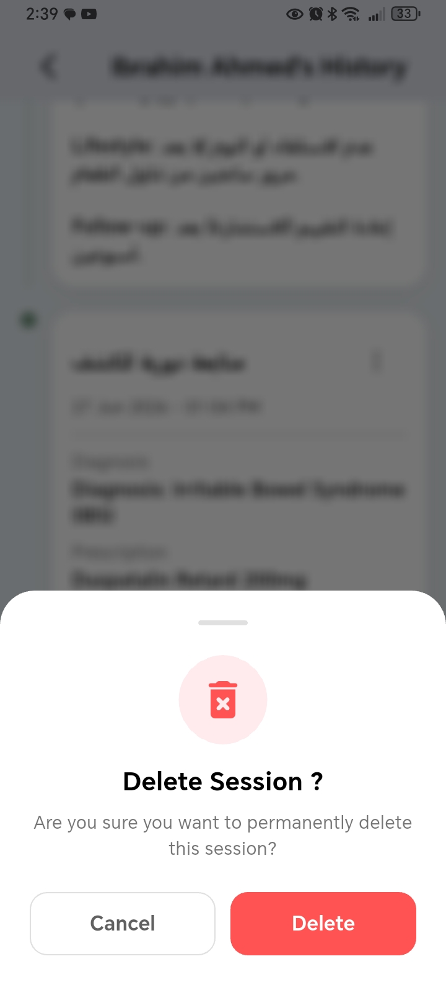
</p>

---

# 🛠️ Tech Stack

* Flutter
* Dart
* flutter_bloc (Cubit)
* MVVM Architecture
* Material Design
* Local Data Storage

---

# 📂 Project Structure

```
lib
│
├── core
│
├── features
│   ├── patients
│   │
│   ├── sessions
│
├── app
│
└── main.dart
```

---

# 🎯 Future Improvements

The current version represents the project's MVP.

Planned future enhancements include:

* Dashboard & Statistics
* Appointment Scheduling
* Medical Attachments
* PDF Reports
* Cloud Synchronization
* Authentication
* Backup & Restore
* Notifications
* Dark Mode
* Multi-Doctor Support

---

# 🤝 Contributing

Contributions, suggestions, and feedback are always welcome.

Feel free to fork the repository, create a feature branch, and submit a pull request.

---

# 👨‍💻 Author

**Mohamed Rafat**

Flutter Developer passionate about building scalable, clean, and user-friendly mobile applications.

If you like this project, don't forget to ⭐ the repository.

